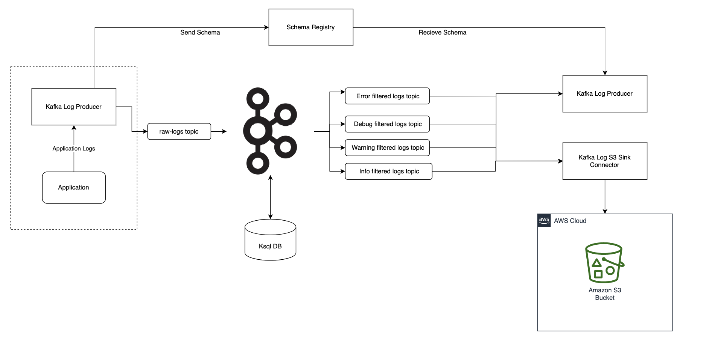
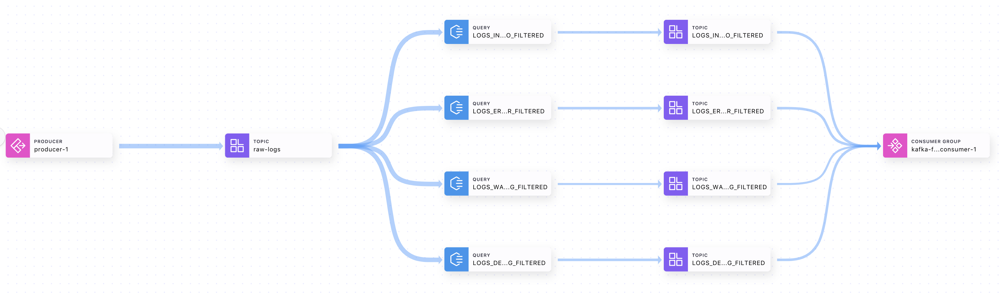
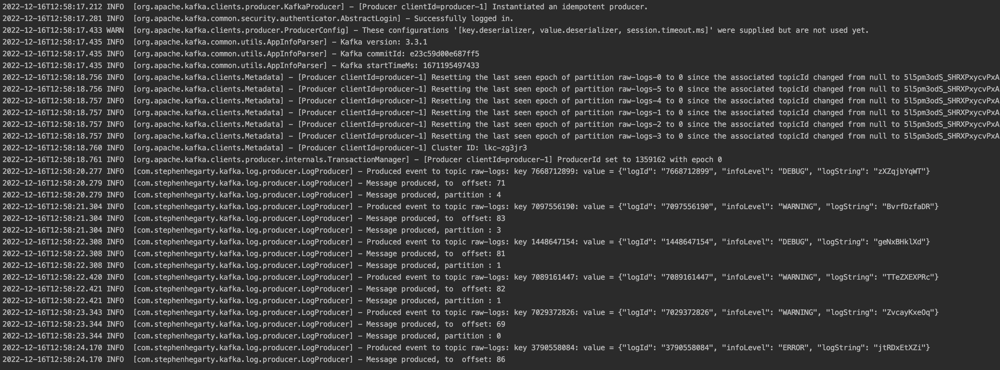
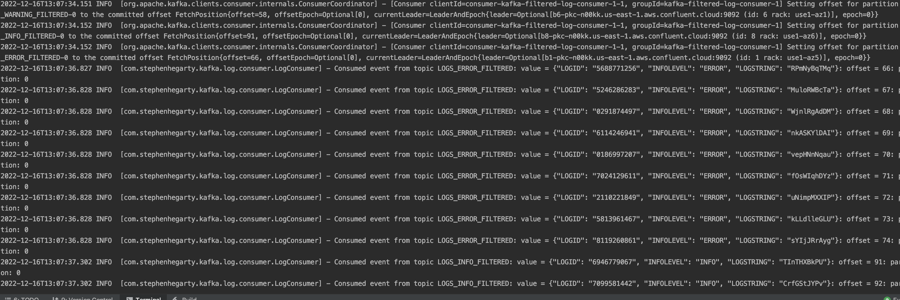

# Confluent kafka Log Audit
Kafka pipeline for consuming application logs and auditing logs based on
info level using KSQL to output logs to individual output topics to be consumed by a java application.

## Overall Architecture

## Confluent Cloud Architecture 

## Repo Structure

The repo contains the four modules:

#### [Kafka Log Common](./kafka-log-common)
This module houses the commonly used dependencies and plugins shared amongst the consumer
and producer modules. This is to for reducing duplication of code and allows for single point of bumping
pom versions for dependencies.

Within in this module, it also auto generates the schema registry for `RawLogMessage` avro via the maven-avro-plugin. 

#### [Kafka Log Producer](./kafka-log-producer)

A simple java 11 application which generates random `RawLogMessage` records, serialises it against the confluent
 cloud schema registry and push it to input topics housed on confluent cloud.

#### [Kafka Log Consumer](./kafka-log-consumer)

A simple java 11 application which consumes `RawLogMessage` records, deserialize it against the confluent
 cloud schema registry. It will read from the following [topics](./kafka-log-common/src/main/java/com/stephenhegarty/kafka/log/common/KsqlOutputTopics.java)

#### [Kafka Log Kstream app](./kafka-log-kstream-app)

TBC

## TODOs

##### Implementation

- [ ] S3 Sink Connector to send each info level topic records to each individual S3 bucket for further storage and analysis

- [ ] Elastic Search Connector to output logs to an ElasticSearch Cluster for Log Search.

##### Testing 

- [ ] Continue to flesh out docker compose file to run dockerised producer and consumer alongside
Kafka ecosystem

- [ ] flesh out unit tests for consumer and producer tests (more positive/negative tests)

##### Confluent Improvements

- [ ] Migrate Confluent Cloud KSQL queries to [kafka-log-kstream-app](./kafka-log-kstream-app)

